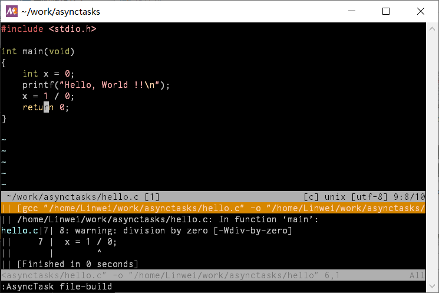

# asynctasks.vim - a modern build/task system

An efficient way to handle building/running tasks by imitating vscode's task system.

[](https://github.com/Naereen/StrapDown.js/blob/master/LICENSE) [](https://GitHub.com/Naereen/StrapDown.js/graphs/commit-activity) [](https://gitter.im/skywind3000/asynctasks.vim?utm_source=badge&utm_medium=badge&utm_campaign=pr-badge&utm_content=badge)

<!-- TOC -->

- [Introduction](#introduction)
- [Get started](#get-started)
- [Build and run a single file](#build-and-run-a-single-file)

<!-- /TOC -->

## Introduction

As vim 8.0 released in 2017, we have got many wonderful plugins like: LSP, DAP and  asynchronous linters. Even things like [vimspector](https://github.com/puremourning/vimspector) which could only been imagined in emacs now exist in vim's community.

But vim is still lack of an elegent system to build/run your project. A lot of people are still dealing with building/running tasks in such a primitive way. Therefor, I decide to create this plugin by introducing vscode's task like machanisms to vim. 

Vscode creates a `.vscode` folder in your project root directory and use a `.vscode/tasks.json` file to define project specific tasks. Similar, `asynctasks.vim` uses a `.tasks` file in your project folders for local tasks and use `~/.vim/tasks.ini` to define global tasks for generic projects.

This is very simple, but most good designs always start from a very simple concept. You will benefit a lot from the productivity and possibility of this task system.

## Get started

Install with `vim-plug`:

```VimL
Plug 'skywind3000/asynctasks.vim'
Plug 'skywind3000/asyncrun.vim'
```

Don't forget to initialize:

```VimL
let g:asyncrun_open = 6
```

And quickfix window can be opened automatically, otherwise you can't see the task output unless use `:copen` manually.

## Build and run a single file

It's convenient for me to build and run a single file directly without creating a new project for that if I want to try some small and new ideas. In this circumstance, we can use `:AsyncTaskEdit` command to edit the `.tasks` configuration file in your current project root directory:

```ini
[file-build]
# macros in the "$(...)" form will be expanded, 
# shell command, use quotation for filenames containing spaces
command=gcc -O2 "$(VIM_FILEPATH)" -o "$(VIM_FILEDIR)/$(VIM_FILENOEXT)"
# working directory
cwd=$(VIM_FILEDIR)

[file-run]
command="$(VIM_FILEDIR)/$(VIM_FILENOEXT)"
cwd=$(VIM_FILEDIR)
# output mode: run in a terminal
output=terminal
```

There are two tasks `file-build` and `file-run` defined in this `.tasks` file. Then from the directory where this `.tasks` reside and its child directories, you can use:

```VimL
:AsyncTask file-build
:AsyncTask file-run
```

To build and run the current file:



This is the result of `:AsyncTask file-build`, the command output displays in the quickfix window and errors are matched with `errorformat`. You can navigate the command output in the quickfix window or use `cnext`/`cprev` to jump between errors.

There are many macros can be used in the command field and will be expanded and replaced when task starts. Having a fast, low-friction Edit/Build/Test cycle is one of the best and easiest ways to increase developer productivity, so we will map them to F5 and F9:

```VimL
noremap <silent><f5> :AsyncTask file-run<cr>
noremap <silent><f9> :AsyncTask file-build<cr>
```

Put the code above in your `vimrc` and you can have F9 to compile current file and F5 to run it. And you may ask, this is for C/C++, what if you want to run a python script, should you create a new task `file-run-python` ? Totally unnecessary, you can define special command for different file types:

```ini
[file-run]
command="$(VIM_FILEPATH)"
command:c,cpp="$(VIM_PATHNOEXT)"
command:go="$(VIM_PATHNOEXT)"
command:python=python "$(VIM_FILENAME)"
command:javascript=node "$(VIM_FILENAME)"
command:sh=sh "$(VIM_FILENAME)"
command:lua=lua "$(VIM_FILENAME)"
command:perl=perl "$(VIM_FILENAME)"
command:ruby=ruby "$(VIM_FILENAME)"
output=terminal
cwd=$(VIM_FILEDIR)
save=2
```

The `command` field accept file type filters, 

