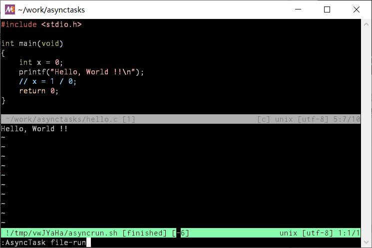
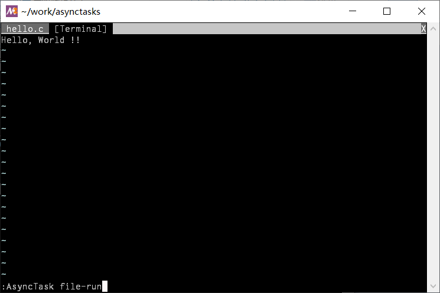
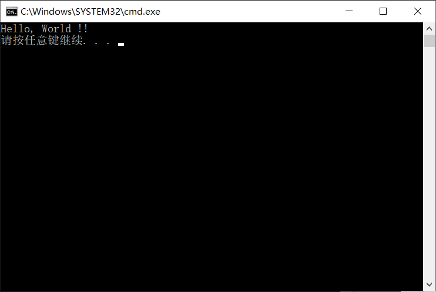
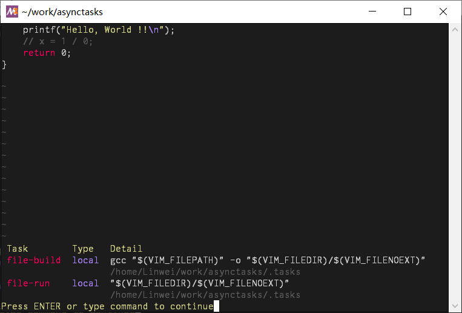
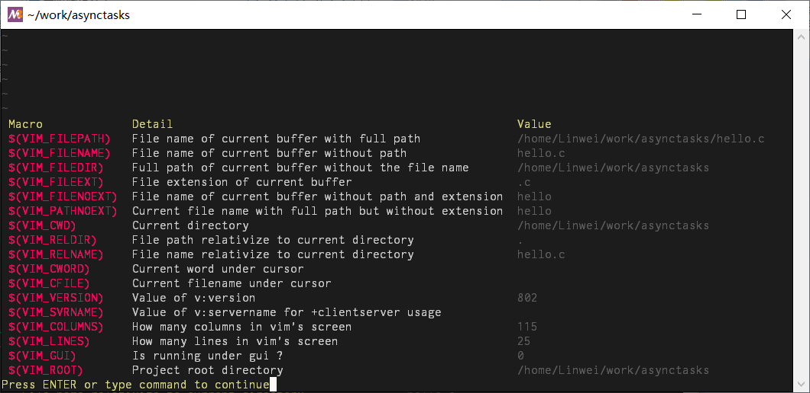

# 简单介绍

这是一个经过思考的，合理的任务构建系统，用于弥补 Vim 长期以来缺乏类似 vscode 任务系统的不足：

- 简单高效，高度定制化。
- 针对项目的局部任务配置，同一个任务绑定同个快捷键，在不同项目中运行特定的命令。
- 全局任务配置，对通用性很强的项目，用全局配置来避免每个项目都配置一遍。
- 丰富的运行模式：quickfix，内置终端，外部终端，传统 `!` 运行，选择你喜欢的方式。
- 在 Vim/NeoVim 下提供完全一致的体验（如今这个越来越难了）。
- 针对文件类型的任务，同一个任务在不同类型文件下运行不同命令。
- 提供接口导出数据，方便同你喜欢的 fuzzyfinder 集成。

Vim/NeoVim 本身在不停的进化，因此重新检讨一些固有的工作流程是有必要的，比如能否在构建这个事情上，让 Vim 的体验提升一截，做到像 vscode 构建系统一样方便流畅呢？

我看过很多 `.vimrc` 配置，大部分在关于如何编译和运行项目这方面，都在用一些非常原始的方法，这么多年下来，仍然缺少一套系统化的解决方案。我也用过不少相关插件：`neomake`，`quickrun` 以及 `dispatch`，大部分只把事情做到一半，都没能完全满足我的需求。

因此我制作了这个插件，希望能为 Vim 提供一套合理的，系统的构建解决方案。


# 安装

使用 [vim-plug](https://github.com/junegunn/vim-plug) 进行安装：
```VimL
Plug 'skywind3000/asynctasks.vim'
Plug 'skywind3000/asyncrun.vim'
```

项目依赖 [asyncrun.vim](https://github.com/skywind3000/asyncrun.vim) 项目 `2.4.0` 及以上版本。记得设置：

```VimL
let g:asyncrun_open = 6
```

告诉 asyncrun 运行时自动打开高度为 6 的 quickfix 窗口，不然你看不到任何输出。

# 内容

<!-- TOC -->

- [概念介绍](#概念介绍)
- [使用手册](#使用手册)
    - [AsyncTask - 运行任务](#asynctask---运行任务)
    - [AsyncTaskEdit - 编辑任务](#asynctaskedit---编辑任务)
    - [宏替换](#宏替换)
    - [项目目录](#项目目录)
    - [运行模式](#运行模式)
    - [内置终端](#内置终端)
    - [保持焦点](#保持焦点)
    - [外部终端](#外部终端)
    - [系统特定任务](#系统特定任务)
    - [文件类型适配](#文件类型适配)
    - [配置搜索](#配置搜索)
    - [其他命令](#其他命令)
- [其他](#其他)

<!-- /TOC -->

## 概念介绍

本插件在运行时会到当前文件所在目录及所有上级目录搜索所有名为 `.tasks` 的文件，并先后加载，同样一个名字的任务可以在不同的配置文件里定义多次，目录层次越深的 `.tasks` 文件拥有越高的优先级。

任务配置文件 `.tasks` 采用 ini 文件格式，每个 section 定义一个任务，你可以在你某个项目的根目录下面放一个 `.tasks` 定义一些针对该项目的任务：

```ini
# 定义一个新任务
[file-build]
# 定义任务需要执行的命令，以 `$(...)` 形式出现的宏会在执行时被具体替换
command=gcc -O2 "$(VIM_FILEPATH)" -o "$(VIM_FILEDIR)/$(VIM_FILENOEXT)"
# 定义命令运行的目录
cwd=$(VIM_FILEDIR)

[file-run]
command="$(VIM_FILEDIR)/$(VIM_FILENOEXT)"
cwd=$(VIM_FILEDIR)
# 定义输出方式，在终端内运行
output=terminal
```

上面定义了两个任务，那么当你在 Vim 中编辑该项目的文件时，执行：

```VimL
:AsyncTask file-build
```

就可以运行名字为 `file-build` 的任务了：


默认模式下（output=quickfix），命令输出会实时显示在下方的 quickfix 窗口中，编译错误会和 errorformat 匹配并显示为高亮，方便你按回车跳转到具体错误，或者用 `cnext`/`cprev` 命令快速跳转错误位置。

如果要查看当前有哪些可用任务，则用 `:AsyncTaskList` 查看有哪些可用任务，然后当你需要编辑任务时，用 `:AsyncTaskEdit` 打开并编辑当前项目的 `.tasks` 文件。

有的项目用 cmake 构建，有的项目用 ninjia 构建，基于项目目录的局部配置机制，让你可以定义同样一个任务名称，绑定同样一个快捷键，却在不同的项目里执行特定的构建命令。同时对一些通用性高的项目将任务定义到全局配置里可以避免每个项目写一遍。

是不是很简单？


## 使用手册

### AsyncTask - 运行任务

运行指定任务，格式为：

```VimL
:AsyncTask {taskname}
```

这条命令很简单，不过注意命令中各种类似 `$(VIM_FILENAME)` 的宏，会根据当前文件展开，因此，避免到一个 nerdtree 的工具窗口里去运行任务，会有很多信息缺失导致宏变量展开成空字符串。


### AsyncTaskEdit - 编辑任务

编辑任务配置文件：

```VimL
:AsyncTaskEdit[!]
```

默认不包含叹号时，编辑的是当前项目的任务配置 `.tasks`，如果加了叹号，则会编辑全局配置 `~/.vim/tasks.ini`。

配置文件不存在的话，会预先生产一个配置模板，类似：

```ini
# 定义一个名为 "file-compile" 的任务
[compile-file]

# 要执行的命令，文件名之类的最好用双引号括起来，避免包含空格出错。
# 不会写可以用 ":AsyncTaskMacro" 命令随时查看宏变量帮助
command=gcc "$(VIM_FILEPATH)" -o "$(VIM_FILEDIR)/$(VIM_FILENOEXT)"

# 工作目录，可以写具体目录，或者宏变量的名字，$(VIM_FILEDIR) 代表文件目录
# 而 $(VIM_ROOT) 或者直接一个 <root> 则代表项目根目录。
cwd=$(VIM_FILEDIR)

# 任务输出，可以选择 "quickfix" 或者 "terminal"
# - quickfix: 将任务输出显示到 quickfix 窗口并进行错误匹配
# - terminal: 在终端内运行任务
output=quickfix

# quickfix 错误匹配的模板，不提供的话会使用 vim 的 errorformat 代替。
# 为空字符串的话，会让在 quickfix 中显示原始文本
errorformat=%f:%l:%m

# 设置成 1 会在运行前保存当前文件，2 保存所有修改过的文件。
save=1
```

不同任务配置的优先级是本地配置高于全局配置，深层目录的配置优先于上层目录的配置，概念有点类似 editorconfig，你可以在多级目录定义同样名称的任务，下层的任务会覆盖上层的同名任务。


### 宏替换

在 `command` 字段和 `cwd` 字段可以使用下面这些宏：

```
$(VIM_FILEPATH)  - 当前 buffer 的文件名全路径
$(VIM_FILENAME)  - 当前 buffer 的文件名（没有前面的路径）
$(VIM_FILEDIR)   - 当前 buffer 的文件所在路径
$(VIM_FILEEXT)   - 当前 buffer 的扩展名
$(VIM_FILENOEXT) - 当前 buffer 的主文件名（没有前面路径和后面扩展名）
$(VIM_PATHNOEXT) - 带路径的主文件名（$VIM_FILEPATH 去掉扩展名）
$(VIM_CWD)       - 当前 Vim 目录（:pwd 命令返回的）
$(VIM_RELDIR)    - 相对于当前路径的文件名
$(VIM_RELNAME)   - 相对于当前路径的文件路径
$(VIM_ROOT)      - 当前 buffer 的项目根目录
$(VIM_CWORD)     - 光标下的单词
$(VIM_CFILE)     - 光标下的文件名
$(VIM_GUI)       - 是否在 GUI 下面运行？
$(VIM_VERSION)   - Vim 版本号
$(VIM_COLUMNS)   - 当前屏幕宽度
$(VIM_LINES)     - 当前屏幕高度
$(VIM_SVRNAME)   - v:servername 的值
$(VIM_INIFILE)   - 当前任务的 ini 文件名
$(VIM_INIHOME)   - 当前任务的 ini 文件的目录（方便调用一些和配置文件位置相关的脚本）
```

在命令执行前，和上面宏同样名称的环境变量也会被初始化出来。比如你的命令很复杂，你根本用不着把很多宏全部塞在命令行里，可以把任务的 `command` 设置成调用某 bash 脚本，而在该脚本里直接用 `$VIM_FILENAME` 这个环境变量就能取出当前的文件名来。

### 项目目录

按照各类 Vim 插件的通俗约定，asynctasks 以及所依赖的 asyncrun 采用项目标识来定位项目的根目录，从当前文件所在目录一直往上递归到根目录，直到发现某一级父目录中包含下列项目标识：

```VimL
let g:asyncrun_rootmarks = ['.git', '.svn', '.root', '.project', '.hg']
```

则认为该目录是当前项目的根目录，如向上搜索到根目录都没找到任何标识，则将当前文件所在目录当作项目根目录。

这些标识文件名你可以配置，如果你有一个项目既不在 git 中，又不在 svn 中怎么办？或者你的 git/svn 的单个仓库下面有很多项目，你并不想让最上层作为项目根目录的话，你只要在你想要的地方新建一个空的 `.root` 文件就行了。

有了项目位置信息后我们就可以在配置任务时用 `$(VIM_ROOT)` 或者 `<root>` 来代替项目位置了：

```ini
[make]
command=make
# 设置在当前项目的根目录处运行 make
cwd=$(VIM_ROOT)

[make-run]
command=make run
# <root> 是 $(VIM_ROOT) 的别名，写起来容易些
cwd=<root>
output=terminal
```

注意，我们定义任务的 `.tasks` 文件 **并不是** 项目标识，因为它可以多层嵌套，同一个项目里定义好几个，还会有项目不定义自己的本地任务，只使用 `tasks.ini` 中定义的全局任务，此时并不需要一个 `.tasks` 配置放在项目中，因此 `.tasks` 配置文件和项目标识是两个维度上的事情。

### 运行模式

配置任务时，`output` 字段可以设置为：

| 名称 | 说明 |
|-|-|
| quickfix | 默认值，实时显示输出到 quickfix 窗口，并匹配 errorformat |
| terminal | 在终端内运行任务 |

前者一般用于一些编译/grep 之类的任务，因为可以在 quickfix 窗口中匹配错误。而后者一般用于一些 “纯运行类” 任务，比如运行你刚才编译出来的程序。

当你将 `output` 设置为 `terminal` 时，将会根据下面一个全局变量指定终端模式：

```VimL
" terminal mode: tab/curwin/top/bottom/left/right/quickfix/external
let g:asynctasks_term_pos = 'quickfix'
```

这个值决定所有 `output=terminal` 的任务到底用什么终端运行，以及在什么地方打开终端，备选项有：

| 选项 | 模式 | 说明 |
|-|-|-|
| quickfix | 模拟 | 默认模式，跳过匹配错误，直接在 quickfix 中显示原始输出 |
| vim | - | 传统 vim 的 `!` 命令运行任务，有些人喜欢这种老模式 |
| tab | 内置终端 | 在新的 tab 上打开内置终端 |
| top | 内置终端 | 在上方打开一个可复用内置终端 |
| bottom | 内置终端 | 在下方打开一个可复用内置终端 |
| left | 内置终端 | 在左边打开一个可复用内置终端 |
| right | 内置终端 | 在右边打开一个可复用内置终端 |
| external | 系统终端 | 打开一个新的操作系统终端窗口运行命令 |

基本上 Vim 中常见的运行模式都包含了，选择一个你喜欢的模式即可。

### 内置终端

当 `output=terminal` 时，设置：

```VimL
let g:asynctasks_term_pos = 'bottom'
```

那么运行 `:AsyncTask file-run` 时，就能在下方的内置终端运行任务了：



终端窗口会复用，如果上一个任务结束了，再次运行时不会新建终端窗口，会先尝试复用老的已结束的终端窗口，找不到才会新建。当使设置为 `top`/`bottom`/`left`/`right` 时，可以用下面两个配置确定终端窗口大小：

```VimL
let g:asynctasks_term_rows = 10    " 设置纵向切割时，高度为 10
let g:asynctasks_term_cols = 80    " 设置横向切割时，宽度为 80
```

有人说分屏的内置终端太小了，没关系，你可以设置成 `tab`：

```VimL
let g:asynctasks_term_pos = 'tab'
```

这样基本就能使用整个 vim 全屏大小的区域了：



整个 tab 都用于运行你的任务，应该足够大了吧？在上下左右分屏模式的终端会复用已有窗口而 tab 终端会每次新建新的 tab，要你结束后自己关闭，可以设置：

```VimL
let g:asynctasks_term_reuse = 1
```

设置成 `1`，让 tab 终端也可以先尝试复用已有的 tab。

除了指定全局的 `g:asynctasks_term_pos` 外，在 `.tasks` 中配置的各个任务里，也可以用 `pos=?` 来强制指定该任务需要何种方式运行。

默认的 `quickfix` 模式尽管也可以运行程序，但是并不适合一些有交互的任务，比如需要用户输入点什么，`quickfix` 模式就没办法了，这时你就需要一个真实的终端，真实终端还能正确的显示颜色，这个在 `quickfix` 是无能为力的事情。

当然，内置终端到 vim 8.1 才稳定下来，处于对老 vim 的支持，asynctasks 默认使用 `quickfix` 模式来运行任务。

### 保持焦点

使用分屏模式的内置终端时（`left`/`right`/`top`/`bottom`），默认运行任务时焦点会跳到终端窗口，这里有个选项：

```VimL
let g:asynctasks_term_focus = 0
```

默认是 `1`，代表改变焦点，如果设置成 `0` 的话，可以将焦点保持在原来的窗口上，看你个人喜欢。


### 外部终端

在 Windows 下经常使用 Visual Studio 的同学们一般会喜欢像 VS 一样，打开一个新的 cmd 窗口来运行程序，我们设置：

```VimL
let g:asynctasks_term_pos = 'external'
```

那么对于所有 `output=terminal` 的任务，就能使用外部系统终端了：



是不是有点 VS 的感觉了？目前该选项仅支持 Windows，但是也很容易就能扩展成：

- 打开新的 `tmux` 窗口来运行
- 打开一个新的 `gnome-terminal` 窗口或者 tab 来运行
- 打开一个新的 `xterm` 窗口来运行
- 打开一个新的 `WSL` 窗口来运行

视需求逐步添加完善吧。

### 系统特定任务

同样一个任务名，你可以配置是 windows 特有，还是 unix 特有：

```ini
[task1:win]
command=echo I am in Windows.

[task1:unix]
command=echo I am in Unix.
```

在任务名后面追加一个冒号，里面可选值为 `win` 或者 `unix`，就能指定适配的操作系统了，上面两个任务，尽管都是叫做 `task1`，但是在不同系统下运行的是不同的命令。

### 文件类型适配

在同一个任务中，可以在 `command` 字段后面用冒号分隔写明适配的 `&filetype`，比如我们写个加强版的 `file-run` 任务：

```ini
[file-run]
command="$(VIM_FILEPATH)"
command:c,cpp="$(VIM_PATHNOEXT)"
command:python=python "$(VIM_FILEPATH)"
command:make=make -f "$(VIM_FILEPATH)"
command:javascript=node "$(VIM_FILEPATH)"
command:sh=sh "$(VIM_FILEPATH)"
command:lua=lua "$(VIM_FILEPATH)"
command:perl=perl "$(VIM_FILEPATH)"
command:ruby=ruby "$(VIM_FILEPATH)"
command:fish=fish "$(VIM_FILEPATH)"
command:php=php "$(VIM_FILEPATH)"
command:erlang=escript "$(VIM_FILEPATH)"
output=terminal
cwd=$(VIM_FILEDIR)
```

不加冒号的 `command` 是默认命令，而加了冒号的 `command` 如果能和 `&filetype` 匹配上，则会优先被使用。

把它放到全局配置（~/.vim/tasks.ini）中，绑定 `:AsyncTask file-run` 到 `<F5>` 上面，那么每次按 F5 运行同样一个任务时，就能根据当前文件类型自动适配对应命令了，是不是很方便？

### 配置搜索

前面一直再说全局配置放在 `~/.vim/tasks.ini` 中，其实是会搜索所有 runtimepath 的，只要任何一个 runtimepath 中存在 `tasks.ini` 都会被加载进来，嫌名字丑没关系，你可以定义：

```VimL
let g:asynctasks_rtp_config = 'etc/tasks.ini'
```

那么就会变成到每个 runtimepath 下面的 `etc` 目录中去找 tasks.ini 了。这样设计有个好处，你可以把全局任务配置文件一起提交到你的 dotfiles 仓库里，记得加载的时候设置一下 `set rtp+=...` 就行了。

对于局部任务配置，就是那个 `.tasks` 的文件名，不喜欢你也可以换：

```VimL
let g:asynctasks_config_name = '.asynctasks'
```

那么就会改为搜索名为 `.asynctasks` 的文件了。

### 其他命令

列出当前可用的 task：

```VimL
:AsyncTaskList
```

效果如下：



该命令能显示可用的 task 名称，具体命令，以及来自哪个配置文件。

显示宏变量帮助：

```VimL
:AsyncTaskMacro
```

显示效果：



左边是宏名称，中间是说明，右边是具体展开值。

这条命令很有用，当你写 task 配置忘记宏名称了，用它随时查看，不用翻文档。

## 其他

TODO
